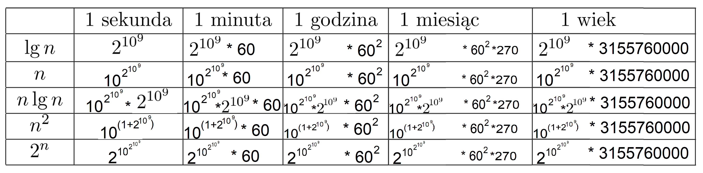

# zadanie 3 AiP konserwatoria
## spis treści
- [zadanie 3 AiP konserwatoria](#zadanie-3-aip-konserwatoria)
  - [spis treści](#spis-treści)
  - [zestaw 2](#zestaw-2)
    - [zadanie 6b](#zadanie-6b)
  - [zestaw 3](#zestaw-3)
    - [dekorator timeFunction](#dekorator-timefunction)
    - [zadanie 1](#zadanie-1)
    - [zadanie 2](#zadanie-2)
    - [zadanie 5](#zadanie-5)
    - [zadanie 7](#zadanie-7)
    - [zadanie 8](#zadanie-8)

## zestaw 2
### zadanie 6b



## zestaw 3

### dekorator timeFunction
odpowiedzialny za test algorytmów sortujących sprawdzenie i czasu wykonania

do każdego algorytmu sortującego wykorzystujemy ten dekoratore by sprawdzić czas wykonania na tej samej liscie wartości 
```
[
    [14,40,31,28,3,15,17,51], 
    [3, 14, 15, 17, 28, 31, 50, 60], 
    [51, 40, 31, 28, 17, 15, 14, 3], 
    [23, 23, 23, 23, 23, 23, 23, 23]
]
```

dekorator:
```py
import time
import copy

listOfNumberLists = [
    [14,40,31,28,3,15,17,51], 
    [3, 14, 15, 17, 28, 31, 50, 60], 
    [51, 40, 31, 28, 17, 15, 14, 3], 
    [23, 23, 23, 23, 23, 23, 23, 23]
]

def timeFunction(function):
    def wrapper():
        estimated = []
        for i in range(10):
            table = copy.deepcopy(listOfNumberLists)
            start = time.perf_counter()
            answers = [function(e) for e in table]
            estimated.append((time.perf_counter() - start))
        print("--- średnia ilość sekund na 10 wykonań ---")
        print("--- %s sekund ---" % (sum(estimated)/len(estimated)))
        print(answers)
    return wrapper
```

### zadanie 1
Python:
```py
for n in range(len(T)):
    lowest = n
    for i in range(n+1, len(T)):
        if T[lowest] > T[i]:
            lowest = i   
    T[n], T[lowest] = T[lowest], T[n]
```
pseudokod:
```
dla n <- 1 do długość tablicy T wykonaj
    lowest <- n
    dla i <- n+1 do długość tablicy T wykonaj
        jeżeli T[lowest] > T[i] wykonaj
            lowest <- i 
    zamień wartości T[n] z T[lowest]
```


### zadanie 2
Python:
```py
@timeFunction
def selection_sort(T):
    for n in range(len(T)):
        lowest = n
        for i in range(n+1, len(T)):
            if T[lowest] > T[i]:
                lowest = i   
        T[n], T[lowest] = T[lowest], T[n]
    return T

selection_sort()
```
output:
```
--- średnia ilość sekund na 10 wykonań ---
--- 2.455000067129731e-05 sekund ---
[
  [3, 14, 15, 17, 28, 31, 40, 51], 
  [3, 14, 15, 17, 28, 31, 50, 60], 
  [3, 14, 15, 17, 28, 31, 40, 51], 
  [23, 23, 23, 23, 23, 23, 23, 23]
]
```


### zadanie 5
Python:
```py
@timeFunction
def bubble_sort(T):
    n = len(T)
    for i in range(n):
        for j in range(i, n)[::-1]:
            if T[j] < T[j-1]:
                T[j], T[j-1] = T[j-1], T[j]
    return T

bubble_sort()
```
output:
```
--- średnia ilość sekund na 10 wykonań ---
--- 4.1690001671668143e-05 sekund ---
[
  [3, 14, 15, 17, 28, 31, 40, 51], 
  [3, 14, 15, 17, 28, 31, 50, 60], 
  [3, 14, 15, 17, 28, 31, 40, 51], 
  [23, 23, 23, 23, 23, 23, 23, 23]
]
```


### zadanie 7
Python:
```py
for i in range(0, len(K)):
    key = K[i]
    n = 1
    while n <= i and key < K[i-n] :
        K[i-n + 1] = K[i-n]
        n += 1
    K[i-n +1] = key
```
pseudokod:
```
dla i <- 0 do długość tablicy K wykonaj
    klucz <- K[i]
    n <- 1
    dopóki n <= i oraz klucz < K[i-n]  wykonaj
        K[i-n + 1] <- K[i-n]
        n <- n + 1 
    K[i-n +1] <- key
```


### zadanie 8
Python:
```py
@timeFunction
def insertion_sort(K):
    for i in range(0, len(K)):
        key = K[i]
        n = 1
        while n <= i and key < K[i-n] :
                K[i-n + 1] = K[i-n]
                n += 1
        K[i-n +1] = key
    return K

insertion_sort()
```
output:
```
--- średnia ilość sekund na 10 wykonań ---
--- 1.781000173650682e-05 sekund ---
[
  [3, 14, 15, 17, 28, 31, 40, 51], 
  [3, 14, 15, 17, 28, 31, 50, 60], 
  [3, 14, 15, 17, 28, 31, 40, 51], 
  [23, 23, 23, 23, 23, 23, 23, 23]
]
```